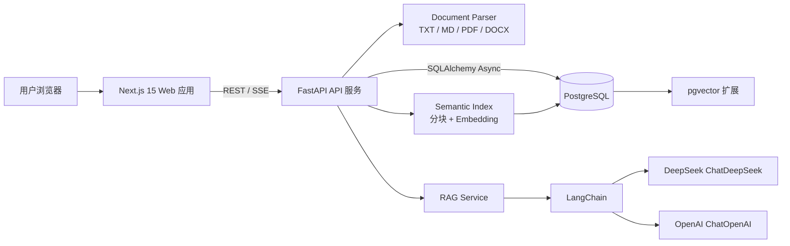
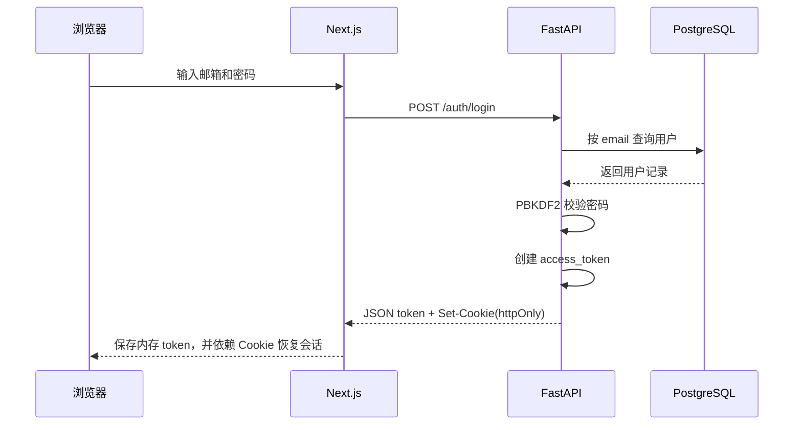
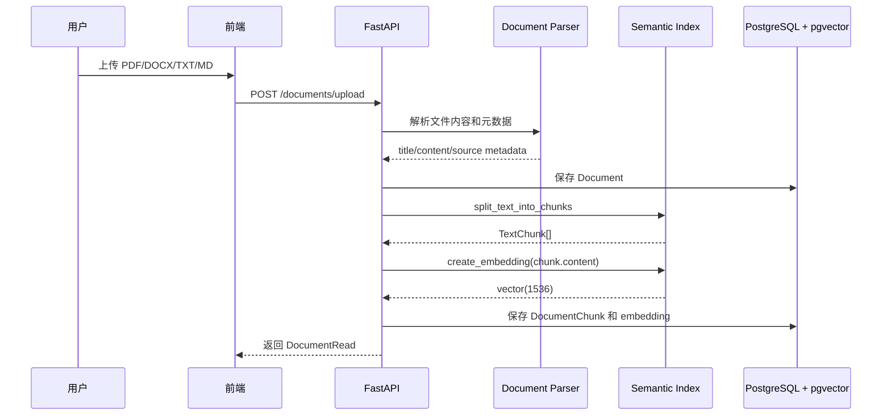
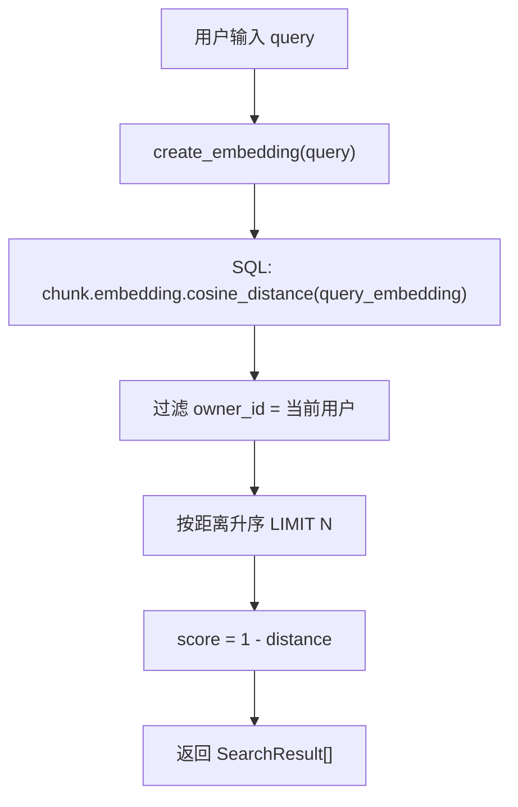
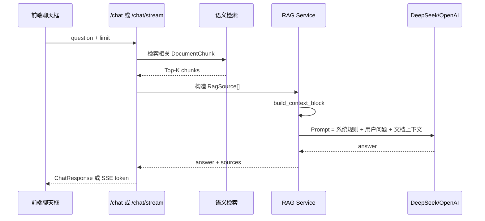
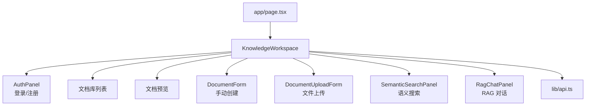
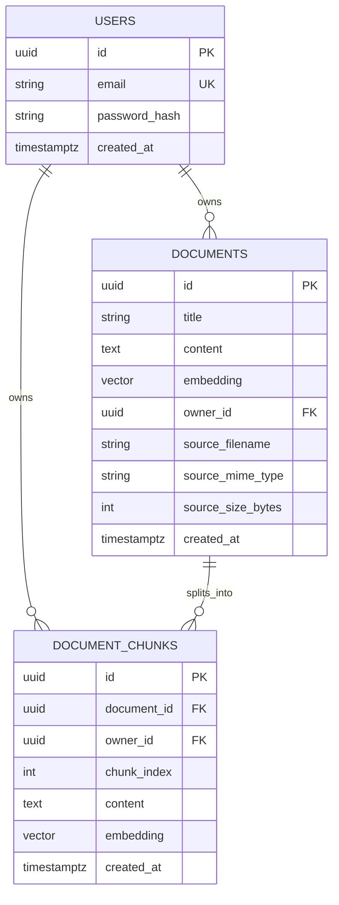
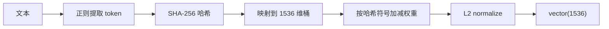
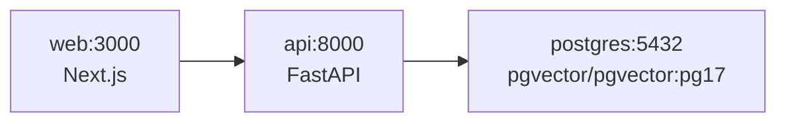

# AILib 项目原理与结构学习报告

> 报告日期：2026-06-12  
> 项目定位：AI 个人知识库助手，全栈 + AI 工程项目  
> 技术栈：Next.js 15 + TypeScript + FastAPI + PostgreSQL + pgvector + LangChain + DeepSeek/OpenAI

## 1. 项目总览

AILib 是一个面向个人知识管理的 RAG 应用。用户可以注册登录、上传或手动创建文档，系统会把文档切分为片段并生成向量，存入 PostgreSQL + pgvector。之后用户可以进行语义搜索，也可以通过聊天界面基于自己的文档内容提问。

项目的核心价值不只是“调用大模型”，而是把一个完整 AI 应用的工程链路串起来：

| 能力 | 对应实现 | 学习重点 |
| --- | --- | --- |
| 用户认证 | FastAPI 认证接口、JWT/httpOnly Cookie、前端会话恢复 | 全栈登录态、权限隔离 |
| 文档管理 | 手动创建、PDF/DOCX/TXT/MD 上传解析 | 文件上传、解析、元数据保存 |
| 向量化 | 本地 feature hashing 或 OpenAI Embedding | 文本向量、降级策略、成本控制 |
| 语义搜索 | pgvector cosine distance + HNSW 索引 | 向量数据库、相似度检索 |
| RAG 对话 | LangChain + DeepSeek/OpenAI + 上下文引用 | 检索增强生成、提示词组织 |
| 流式输出 | SSE streaming | 类 ChatGPT 的增量响应 |
| 部署 | Docker Compose、Railway 适配 | 单仓库多服务部署 |

## 2. 整体架构



### 2.1 请求链路分层

| 层级 | 目录/文件 | 职责 |
| --- | --- | --- |
| 前端交互层 | `apps/web/app`、`apps/web/components` | 页面布局、登录表单、文档区、搜索区、聊天区 |
| 前端 API 封装 | `apps/web/lib/api.ts` | 统一封装 fetch、Cookie 凭证、SSE 流式解析 |
| 后端路由层 | `apps/api/app/api/auth.py`、`apps/api/app/api/routes.py` | 暴露认证、文档、搜索、聊天接口 |
| 后端依赖层 | `apps/api/app/api/deps.py` | 数据库 Session、当前用户解析、权限保护 |
| 业务服务层 | `apps/api/app/services` | 文档解析、分块、向量化、RAG 生成 |
| 数据模型层 | `apps/api/app/models` | SQLAlchemy ORM 模型 |
| 数据库迁移 | `apps/api/alembic` | 建表、索引、pgvector 扩展 |
| 部署层 | `docker-compose.yml`、各 Dockerfile | 本地容器化和平台部署 |

## 3. 目录结构说明

```text
AILib/
├── apps/
│   ├── api/                         # FastAPI 后端
│   │   ├── app/
│   │   │   ├── api/                 # 路由和依赖
│   │   │   ├── core/                # 配置和安全工具
│   │   │   ├── db/                  # 数据库连接
│   │   │   ├── models/              # ORM 模型
│   │   │   ├── services/            # AI / 文档 / RAG 服务
│   │   │   ├── main.py              # FastAPI 入口
│   │   │   └── schemas.py           # Pydantic DTO
│   │   ├── alembic/                 # 数据库迁移
│   │   ├── tests/                   # 后端测试
│   │   ├── Dockerfile
│   │   └── requirements.txt
│   └── web/                         # Next.js 前端
│       ├── app/                     # App Router 页面和全局样式
│       ├── components/              # UI 组件
│       ├── e2e/                     # Playwright E2E
│       ├── lib/api.ts               # API 客户端
│       └── Dockerfile
├── docs/                            # 项目文档和阶段总结
├── infra/postgres/init/             # PostgreSQL 初始化脚本
├── docker-compose.yml
└── README.md
```

## 4. 后端原理

后端是一个典型的“路由层 + 服务层 + 数据层”结构。路由只负责请求/响应和权限校验，复杂逻辑放在 `services`，数据库结构由 `models` 和 Alembic 管理。

### 4.1 FastAPI 入口

| 文件 | 作用 |
| --- | --- |
| `apps/api/app/main.py` | 创建 FastAPI 应用，配置 CORS，挂载认证和业务路由 |
| `apps/api/app/api/auth.py` | 注册、登录、登出、当前用户 |
| `apps/api/app/api/routes.py` | 健康检查、文档、上传、搜索、RAG 聊天 |

### 4.2 认证流程



认证设计要点：

| 机制 | 位置 | 说明 |
| --- | --- | --- |
| 密码哈希 | `core/security.py` | 使用 PBKDF2-HMAC-SHA256，避免明文保存密码 |
| Token | `core/security.py` | 使用 HMAC-SHA256 签名的访问令牌 |
| Cookie | `api/auth.py` | 登录时写入 httpOnly Cookie，前端 JS 不能直接读取 |
| 当前用户 | `api/deps.py` | 同时支持 Bearer token 和 Cookie token |
| 数据隔离 | `api/routes.py` 查询条件 | 文档、搜索、聊天都限定 `owner_id == current_user.id` |

### 4.3 文档上传与入库流程



文档处理模块：

| 文件 | 关键对象/函数 | 说明 |
| --- | --- | --- |
| `services/document_parser.py` | `ParsedDocument` | 解析后的标题、正文、文件名、MIME、大小 |
| `services/document_parser.py` | `parse_uploaded_document` | 按后缀分发 TXT/MD/PDF/DOCX 解析 |
| `services/semantic_index.py` | `split_text_into_chunks` | 文本归一化、按词窗口分块、保留 overlap |
| `services/semantic_index.py` | `create_embedding` | 根据配置选择 local 或 OpenAI embedding |
| `api/routes.py` | `add_document_chunks` | 把分块和向量写入 `document_chunks` 表 |

### 4.4 语义搜索流程



pgvector 查询的核心思想是：把用户问题也转成同维度向量，然后在当前用户的所有文档片段中找 cosine distance 最小的片段。后端返回时把距离转换为 `score = 1 - distance`，前端展示为相似度。

### 4.5 RAG 对话流程



RAG 的关键原则：

| 原则 | 代码位置 | 说明 |
| --- | --- | --- |
| 先检索再生成 | `api/routes.py` | `/chat` 复用向量检索结果作为上下文 |
| 上下文编号 | `services/rag.py` | 每个来源被编号，回答可用 `[1]` 引用 |
| 无上下文保护 | `services/rag.py` | 没有匹配片段时返回固定提示，不让模型凭空回答 |
| Provider 可切换 | `services/rag.py` + `.env` | `CHAT_PROVIDER=mock/openai/deepseek` |
| 流式体验 | `api/routes.py` | `/chat/stream` 使用 SSE 输出 sources/token/done |

### 4.6 流式输出事件

| SSE 事件 | 含义 | 前端处理 |
| --- | --- | --- |
| `sources` | 先发送引用来源 | 聊天消息中展示来源列表 |
| `token` | 模型增量文本 | 持续追加到回答 |
| `error` | 生成失败 | 展示错误状态 |
| `done` | 流结束 | 关闭 loading 状态 |

## 5. 前端原理

前端使用 Next.js App Router。页面主体在 `KnowledgeWorkspace`，它集中管理登录态、文档列表、选中文档、状态提示，并把具体功能拆给多个组件。

### 5.1 前端组件结构



### 5.2 前端状态设计

| 状态 | 所在文件 | 作用 |
| --- | --- | --- |
| `token` | `components/knowledge-workspace.tsx` | 内存中的 Bearer token 兜底 |
| `user` | `components/knowledge-workspace.tsx` | 当前登录用户 |
| `documents` | `components/knowledge-workspace.tsx` | 当前用户的文档列表 |
| `selectedDocumentId` | `components/knowledge-workspace.tsx` | 当前预览的文档 |
| `documentFilter` | `components/knowledge-workspace.tsx` | 文档库搜索过滤 |
| `status` | `components/knowledge-workspace.tsx` | 顶部操作反馈 |

### 5.3 API 客户端

`apps/web/lib/api.ts` 是前后端边界。它统一处理：

| 能力 | 说明 |
| --- | --- |
| API 地址 | 浏览器使用 `NEXT_PUBLIC_API_BASE_URL`，服务端可用 `API_SERVER_BASE_URL` |
| 登录凭证 | `credentials: "include"` 自动携带 httpOnly Cookie |
| JSON 请求 | `authHeaders` 注入 `Content-Type` 和 Bearer token |
| 文件上传 | 使用 `FormData`，不手动设置 `Content-Type` |
| SSE | 解析 `event:` 和 `data:`，分发给回调 |

## 6. 数据库设计

### 6.1 ER 图



### 6.2 表结构

#### users

| 字段 | 类型 | 约束 | 说明 |
| --- | --- | --- | --- |
| `id` | UUID | Primary Key | 用户唯一标识 |
| `email` | String(320) | Unique, Index, Not Null | 登录邮箱，保存前转小写 |
| `password_hash` | String(255) | Not Null | PBKDF2 密码哈希 |
| `created_at` | DateTime(timezone=True) | Not Null | 创建时间 |

#### documents

| 字段 | 类型 | 约束 | 说明 |
| --- | --- | --- | --- |
| `id` | UUID | Primary Key | 文档唯一标识 |
| `title` | String(255) | Not Null | 文档标题 |
| `content` | Text | Not Null | 原始完整正文 |
| `embedding` | Vector(1536) | Nullable | 文档级向量，当前主要使用 chunk 向量 |
| `owner_id` | UUID | FK users.id, Index | 所属用户 |
| `source_filename` | String(255) | Nullable | 上传文件名 |
| `source_mime_type` | String(120) | Nullable | MIME 类型 |
| `source_size_bytes` | Integer | Nullable | 文件大小 |
| `created_at` | DateTime(timezone=True) | Not Null | 创建时间 |

#### document_chunks

| 字段 | 类型 | 约束 | 说明 |
| --- | --- | --- | --- |
| `id` | UUID | Primary Key | 片段唯一标识 |
| `document_id` | UUID | FK documents.id, Not Null | 所属文档 |
| `owner_id` | UUID | FK users.id, Not Null | 所属用户，用于快速权限过滤 |
| `chunk_index` | Integer | Not Null | 文档内片段顺序 |
| `content` | Text | Not Null | 片段正文 |
| `embedding` | Vector(1536) | Not Null | 片段向量 |
| `created_at` | DateTime(timezone=True) | Not Null | 创建时间 |

### 6.3 索引设计

| 索引 | 表 | 用途 |
| --- | --- | --- |
| `ix_users_email` | `users` | 登录时按邮箱查询 |
| `ix_documents_owner_id` | `documents` | 查询当前用户文档 |
| `ix_document_chunks_document_id` | `document_chunks` | 加载某个文档的所有片段 |
| `ix_document_chunks_owner_id` | `document_chunks` | 按用户隔离搜索范围 |
| `ix_document_chunks_owner_document` | `document_chunks` | 用户 + 文档组合查询 |
| `ix_document_chunks_embedding_hnsw` | `document_chunks` | pgvector HNSW 向量近似搜索 |

HNSW 索引用于提高向量相似度搜索性能。当前使用 `vector_cosine_ops`，与代码里的 cosine distance 查询保持一致。

## 7. 关键类和数据结构

### 7.1 ORM 模型

| 类 | 文件 | 关系 | 说明 |
| --- | --- | --- | --- |
| `User` | `models/user.py` | `User.documents` | 用户表模型 |
| `Document` | `models/document.py` | `Document.owner`、`Document.chunks` | 原始文档模型 |
| `DocumentChunk` | `models/document_chunk.py` | `DocumentChunk.document`、`DocumentChunk.owner` | 文档片段和向量模型 |

### 7.2 Pydantic Schema

| Schema | 用途 | 主要字段 |
| --- | --- | --- |
| `HealthResponse` | 健康检查响应 | `status`、`database` |
| `RegisterRequest` | 注册请求 | `email`、`password` |
| `LoginRequest` | 登录请求 | `email`、`password` |
| `AuthResponse` | 登录/注册响应 | `access_token`、`token_type`、`user` |
| `DocumentCreate` | 手动创建文档 | `title`、`content`、`embedding` |
| `DocumentRead` | 文档响应 | 文档元数据、向量维度、chunk 数 |
| `SearchRequest` | 搜索请求 | `query`、`limit` |
| `SearchResult` | 搜索结果 | 文档、chunk、内容、score |
| `ChatRequest` | 聊天请求 | `question`、`limit` |
| `ChatResponse` | 聊天响应 | `answer`、`sources` |

### 7.3 服务层数据结构

| 对象 | 文件 | 说明 |
| --- | --- | --- |
| `TextChunk` | `services/semantic_index.py` | 分块后的文本片段，包含 `index` 和 `content` |
| `ParsedDocument` | `services/document_parser.py` | 上传文件解析结果 |
| `RagSource` | `services/rag.py` | RAG 输入来源，包含标题、内容、分数和文件名 |
| `RagGenerationError` | `services/rag.py` | LLM 调用失败时的业务异常 |
| `LangChainUnavailableError` | `services/rag.py` | LangChain provider 包缺失时的异常 |

### 7.4 前端类型和组件

| 类型/组件 | 文件 | 说明 |
| --- | --- | --- |
| `User` | `lib/api.ts` | 当前用户类型 |
| `DocumentItem` | `lib/api.ts` | 文档列表项 |
| `SearchResult` | `lib/api.ts` | 搜索结果类型 |
| `ChatResponse` | `lib/api.ts` | 非流式聊天响应 |
| `KnowledgeWorkspace` | `components/knowledge-workspace.tsx` | 主工作台 |
| `AuthPanel` | `components/auth-panel.tsx` | 登录注册 |
| `DocumentForm` | `components/document-form.tsx` | 手动创建文档 |
| `DocumentUploadForm` | `components/document-upload-form.tsx` | 文件上传 |
| `SemanticSearchPanel` | `components/semantic-search-panel.tsx` | 语义搜索 |
| `RagChatPanel` | `components/rag-chat-panel.tsx` | RAG 聊天和流式输出 |

## 8. 核心算法解释

### 8.1 文本分块

`split_text_into_chunks` 采用“按词窗口 + overlap”的方式：

1. 先把文本里的多余空白统一归一化。
2. 按空格切成词序列。
3. 每个 chunk 取 `chunk_size` 个词。
4. 下一个 chunk 从 `chunk_size - chunk_overlap` 后开始。
5. 保存 `chunk_index`，方便回答时定位来源。

这种方式实现简单、可解释，适合学习项目。它的不足是没有按语义边界切分，后续可以升级为 LangChain text splitter 或 Markdown-aware splitter。

### 8.2 本地 Embedding 降级方案

本地 embedding 不是大模型语义向量，而是 feature hashing：



这个设计的价值：

| 优点 | 说明 |
| --- | --- |
| 零成本 | 不需要调用外部 embedding API |
| 可离线运行 | 没有网络时仍可演示完整流程 |
| 维度兼容 | 与 `vector(1536)` 数据库结构一致 |
| 可替换 | 生产环境可切到 OpenAI embedding |

局限：

| 局限 | 影响 |
| --- | --- |
| 语义理解弱 | 对同义词、复杂语义关系不敏感 |
| 依赖字面重合 | 更像“增强版关键词检索” |
| 不适合高质量生产搜索 | 简历项目可展示架构，真实使用建议接入高质量 embedding |

### 8.3 向量检索

查询语句的逻辑可以理解为：

```text
在 document_chunks 中：
1. 只查当前用户 owner_id 的片段；
2. 计算每个片段 embedding 到 query_embedding 的 cosine distance；
3. 按 distance 从小到大排序；
4. 取前 limit 条；
5. 返回 score = 1 - distance。
```

这个设计保证了两个关键点：

| 目标 | 实现 |
| --- | --- |
| 数据隔离 | `owner_id == current_user.id` |
| 搜索性能 | pgvector HNSW 索引 |

### 8.4 RAG Prompt 组织

RAG 不是直接把问题丢给模型，而是先构造上下文：

```text
系统规则：
- 只能基于提供的资料回答
- 不知道就说明资料不足
- 引用来源编号

用户问题：
{question}

资料：
[1] title / source / score / content
[2] title / source / score / content
...
```

这种提示词结构能减少幻觉，并让用户看到答案依据。

## 9. 配置和环境变量

### 9.1 后端核心配置

| 环境变量 | 示例 | 说明 |
| --- | --- | --- |
| `DATABASE_URL` | `postgresql+asyncpg://...` | PostgreSQL 连接 |
| `ALLOWED_ORIGINS` | `http://localhost:3000` | CORS 白名单 |
| `SECRET_KEY` | 自定义长随机字符串 | Token 签名密钥 |
| `AUTH_COOKIE_NAME` | `ailib_access_token` | Cookie 名 |
| `AUTH_COOKIE_SECURE` | `false/true` | HTTPS 部署时应为 true |
| `AUTH_COOKIE_SAMESITE` | `lax/none` | 跨站 Cookie 策略 |
| `UPLOAD_MAX_BYTES` | `10485760` | 上传文件大小上限 |
| `EMBEDDING_PROVIDER` | `local/openai` | 向量生成 provider |
| `EMBEDDING_DIMENSIONS` | `1536` | 向量维度，需匹配数据库 |
| `EMBEDDING_MODEL` | `text-embedding-3-small` | OpenAI embedding 模型 |
| `CHAT_PROVIDER` | `mock/deepseek/openai` | RAG 聊天 provider |
| `CHAT_MODEL` | `deepseek-v4-pro` | 聊天模型名 |
| `DEEPSEEK_API_KEY` | `sk-...` | DeepSeek API Key |
| `DEEPSEEK_API_BASE` | `https://api.deepseek.com` | DeepSeek API 地址 |
| `OPENAI_API_KEY` | `sk-...` | OpenAI API Key |

### 9.2 前端核心配置

| 环境变量 | 示例 | 说明 |
| --- | --- | --- |
| `NEXT_PUBLIC_API_BASE_URL` | `https://api.example.com` | 浏览器访问 API 的地址 |
| `API_SERVER_BASE_URL` | `http://api:8000` | Next.js 服务端访问 API 的内部地址 |

### 9.3 Railway 单仓库部署提示

Railway 的 Source Repo 只显示 `Sin-253x/AILib` 是正常的，因为 GitHub 仓库本身只有一个。这个项目是 monorepo，`apps/api` 和 `apps/web` 不是独立仓库，而是同一仓库下的子目录。

部署时应理解为：

| 服务 | Source Repo | Root/Build Context | 说明 |
| --- | --- | --- | --- |
| API Service | `Sin-253x/AILib` | `apps/api` 或指定 API Dockerfile | FastAPI 服务 |
| Web Service | `Sin-253x/AILib` | `apps/web` 或指定 Web Dockerfile | Next.js 服务 |
| Database | Railway PostgreSQL | 不适用 | 需要启用 pgvector 或使用支持 pgvector 的镜像/插件 |

如果 Railway UI 没有在 Source Repo 下拉框里显示子目录，不代表不能部署子目录。子目录通常在服务的 Settings / Build / Root Directory / Dockerfile Path 中配置。

## 10. 本地运行和部署结构

### 10.1 Docker Compose 拓扑



### 10.2 服务职责

| 服务 | 镜像/构建 | 端口 | 说明 |
| --- | --- | --- | --- |
| `postgres` | `pgvector/pgvector:pg17` | `5432` | 数据库和向量扩展 |
| `api` | `apps/api/Dockerfile` | `8000` | FastAPI + RAG 服务 |
| `web` | `apps/web/Dockerfile` | `3000` | Next.js 前端 |

## 11. 测试与质量保障

| 测试类型 | 位置 | 覆盖内容 |
| --- | --- | --- |
| 后端单元测试 | `apps/api/tests` | 配置、认证、安全、文档解析、RAG、路由等 |
| 前端 E2E | `apps/web/e2e/workspace.spec.ts` | 用户工作流和页面交互 |
| 类型检查 | `apps/web` TypeScript | 前端类型安全 |
| 代码风格 | `apps/api` Ruff | Python 代码风格 |
| 数据库迁移 | `apps/api/alembic` | 表结构可重复创建 |

## 12. 学习阅读顺序

建议按下面顺序读源码，这样能先理解主链路，再深入细节：

1. `README.md`  
   先了解项目目标、运行方式和整体功能。

2. `docker-compose.yml`  
   看清楚 Web、API、PostgreSQL 三个服务如何连接。

3. `apps/api/app/main.py`  
   理解 FastAPI 应用如何启动和挂载路由。

4. `apps/api/app/api/auth.py` + `apps/api/app/core/security.py`  
   学登录注册、密码哈希、token、Cookie。

5. `apps/api/app/models/*.py` + `apps/api/alembic/versions/*.py`  
   对照 ORM 和真实数据库迁移，理解表结构。

6. `apps/api/app/services/document_parser.py`  
   学文件上传后如何变成纯文本。

7. `apps/api/app/services/semantic_index.py`  
   学文本分块和 embedding。

8. `apps/api/app/api/routes.py`  
   把文档、搜索、聊天接口串起来。

9. `apps/api/app/services/rag.py`  
   学 LangChain、DeepSeek/OpenAI provider、流式输出。

10. `apps/web/lib/api.ts`  
    学前端如何调用后端、如何解析 SSE。

11. `apps/web/components/knowledge-workspace.tsx`  
    学前端主状态和整体 UI 组织。

12. 其他前端组件  
    分别理解登录、上传、搜索、聊天的交互细节。

## 13. 项目亮点

| 亮点 | 为什么适合简历 |
| --- | --- |
| 全栈闭环 | 前端、后端、数据库、AI、部署都有实际代码 |
| RAG 链路完整 | 包含 ingestion、chunk、embedding、vector search、LLM answer |
| 权限隔离明确 | 每个查询都围绕当前用户做数据隔离 |
| provider 可切换 | 支持 mock、DeepSeek、OpenAI，便于演示和成本控制 |
| 支持真实文件 | PDF/DOCX 解析比纯文本 demo 更接近实际场景 |
| 流式输出 | 用户体验更接近成熟 AI 产品 |
| 容器化部署 | 可本地 Docker Compose，也能适配 Railway |

## 14. 后续优化路线

| 优化方向 | 当前状态 | 建议 |
| --- | --- | --- |
| Embedding 质量 | 本地 feature hashing 可演示，语义能力有限 | 接入高质量 embedding 模型 |
| 文档切分 | 按词窗口 | 改为 Markdown/PDF 结构感知切分 |
| 引用定位 | chunk 级引用 | 增加页码、段落、字符范围 |
| RAG 评测 | 主要靠人工验证 | 加入固定问答集和自动评分 |
| 权限模型 | 单用户所有权 | 增加团队空间、共享文档 |
| 搜索排序 | 单纯向量相似度 | 加入 BM25 + rerank 混合检索 |
| 任务队列 | 上传后同步处理 | 大文件改为后台任务 |
| 观测性 | 基础日志 | 增加请求追踪、LLM 调用日志、成本统计 |

## 15. 一句话理解 AILib

AILib 的本质是：把“用户私有文档”转换成“可检索的向量知识库”，再用“检索结果约束大模型回答”，从而实现一个能基于个人资料回答问题的 AI 助手。
